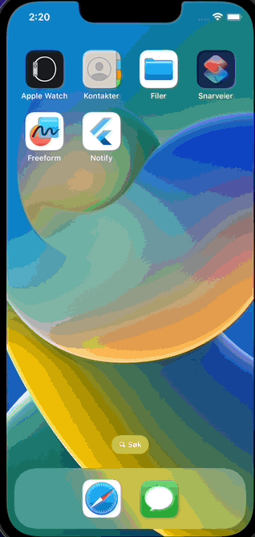

# Notify

A cross-platform basic application for creating and managing local notificaions on devices created using the Flutter framework.

  

## Supported Platforms

- macOS v10.11+.
- iOS 8.0+

## Key libraries

-  - NoSQL database
-  - Event-driven state managment
-  - Creating and schedulig local notifications
